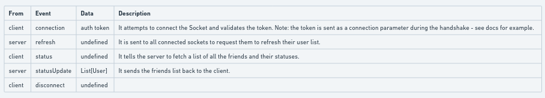
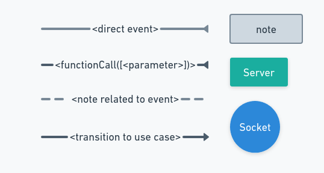
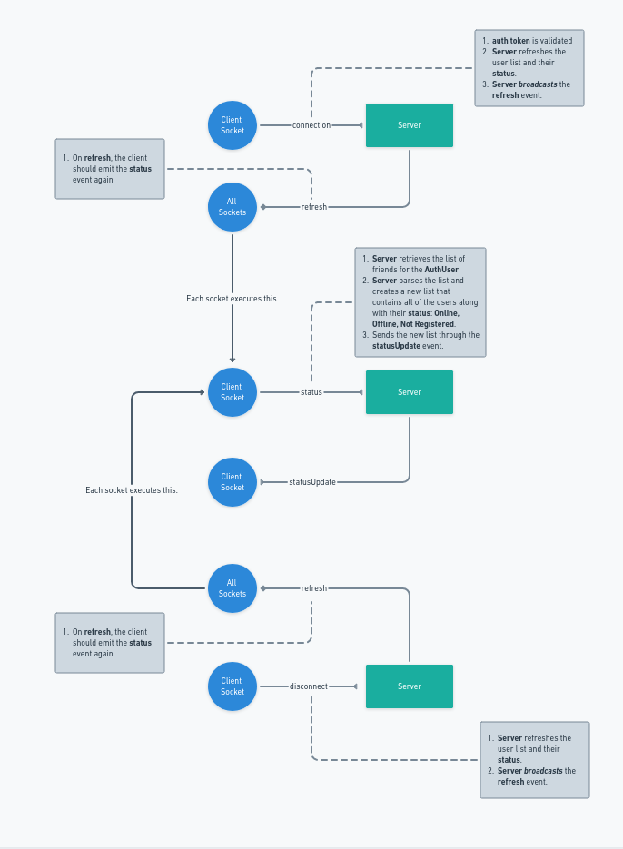
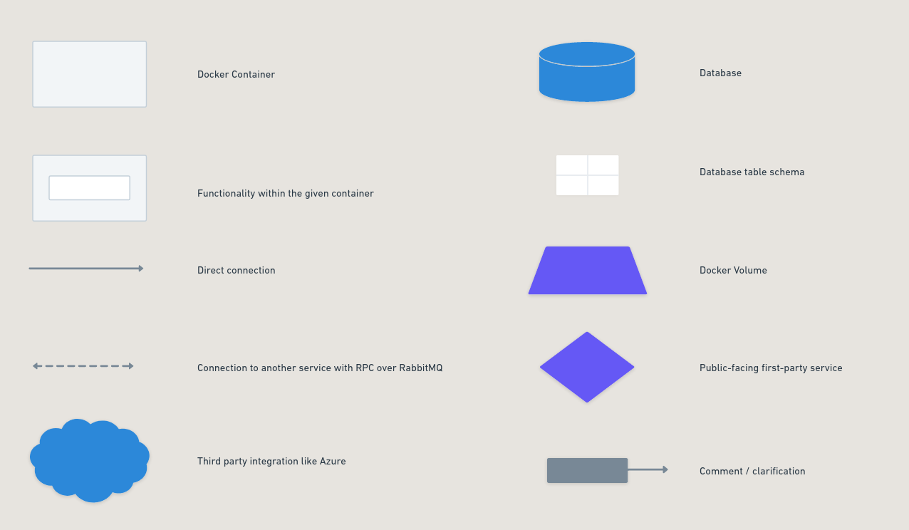

# Overview of the system
Each of the large diagrams is clickable and will direct you to the Whimsical page where they reside.

You will only have read permission on that page.

# Sockets Diagram

### Data flow description

### Legend

### Diagram
]

# System Architecture

### Legend

### Diagram
Each component in this diagram contains the name of the author who made it

